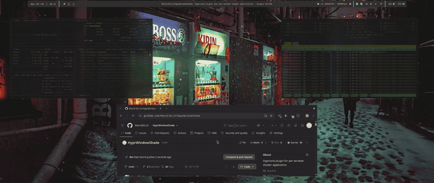

# HyprWindowShade

A Hyprland plugin that applies fragment shaders to individual windows (or layers) based on window rules. Shaders are HyprShade-compatible — if it works in HyprShade, it should work here. A `time` uniform is available for glitch-style animated effects, and windows and layers can play one-shot shaders as they open and close.

Configuration is shown in Hyprland's Lua config format (`hyprland.lua`). The old `hyprland.conf` format still parses in 0.56 but Hyprland itself warns that support is removed in 0.57 — everything `.conf`-specific lives in [Legacy: hyprland.conf](#legacy-hyprlandconf).

> This has not been stress-tested. It may break when Hyprland updates or simply not work on your system. Only tested on AMD graphics on Arch. Good luck, have fun, don't say I didn't warn ya.



Four of the effects, in order: [reading mode](#keybind-examples) toggled onto Chrome by
class, [pixelate](#layer-shaders) toggled onto the `mpvpaper` wallpaper layer, rofi
opening and closing with its own
[layer animations](#layer-surfaces-rofiwofi-notifications-bars), and a jelly
[wobble](#move-and-resize-animations) as a terminal is moved and resized. The glitch on
the unfocused windows runs throughout.

The GIF is cut down and dithered to keep the page light. The full 31s reel at 1280p is
[`docs/demo.mp4`](docs/demo.mp4) — GitHub will not play it inline, so that link
downloads it.

---

## Contents

- [Quick start](#quick-start)
- [Requirements](#requirements) · [Install](#install)
- [Window shaders](#window-shaders) — [stacking](#stacking) · [fullscreen](#fullscreen) · [fallback rules](#fallback-rules)
- [Layer shaders](#layer-shaders)
- [Open and close animations](#open-and-close-animations)
- [Move and resize animations](#move-and-resize-animations)
- [Writing a shader](#writing-a-shader)
- [Reference](#reference) — [Lua API](#lua-api) · [hyprctl dispatch](#hyprctl-dispatch) · [shader uniforms](#shader-uniforms)
- [How close animations work](#how-close-animations-work)
- [Troubleshooting](#troubleshooting)
- [Legacy: hyprland.conf](#legacy-hyprlandconf)
- [Development](#development)
- [Extending the plugin](#extending-the-plugin)

---

## Quick start

Save this as `~/.config/hypr/shaders/dim.glsl`:

```glsl
#version 320 es
precision highp float;

in vec2 v_texcoord;
out vec4 fragColor;
uniform sampler2D tex;
uniform float is_active;

void main() {
    fragColor = texture(tex, v_texcoord);
    fragColor.rgb *= mix(0.6, 1.0, is_active);   // dim while unfocused
}
```

Install the plugin ([Install](#install)), then add one rule to `hyprland.lua`:

```lua
hl.window_rule({
    name  = "kitty-dim",
    match = { class = "kitty" },
    tag   = "+shader:/home/USERNAME/.config/hypr/shaders/dim.glsl",
})
```

Reload the config. Every kitty window is now dimmed while unfocused and full brightness while focused. Edit `dim.glsl` and save — the change takes effect on the next frame, no reload needed.

---

## Requirements

- **Hyprland 0.56** (the plugin is built against this version's internal API).
- A **Lua config** (`~/.config/hypr/hyprland.lua`). A `.conf` config still works in 0.56 — see [Legacy: hyprland.conf](#legacy-hyprlandconf) — but Hyprland drops it in 0.57.
- **GLSL ES 3.20** fragment shaders. The plugin uses Hyprland's `TEXVERTSRC320` vertex shader, so your fragment shader should start with `#version 320 es` and declare `in vec2 v_texcoord;`, `out vec4 fragColor;`, and `uniform sampler2D tex;` (same interface HyprShade uses).
- To build it — whether through hyprpm or from source — a C++23 toolchain and the deps hyprpm itself needs: `cmake`, `cpio`, `pkg-config`, `git`, `g++`, `gcc`, plus `make`.

---

## Install

### With hyprpm (recommended)

```sh
hyprpm add https://github.com/ManofJELLO/HyprWindowShade
hyprpm enable HyprWindowShade
```

Then have hyprpm load your plugins at session start, in `hyprland.lua`:

```lua
hl.on("hyprland.start", function()
    hl.exec_cmd("hyprpm reload -n")
end)
```

hyprpm builds the plugin against headers matching your running Hyprland, so after a
Hyprland upgrade `hyprpm update` is all you need.

### From source

```sh
git clone https://github.com/ManofJELLO/HyprWindowShade
cd HyprWindowShade
./build.sh
```

`build.sh` compiles, verifies the result, installs it, and hot-loads it into the running
session. Use `./build.sh --build-only` to compile and verify without touching a live
session — worth preferring while you're changing anything, since a misbehaving plugin
takes the whole compositor with it.

Then load it **at session start**:

```lua
hl.on("hyprland.start", function()
    hl.exec_cmd("hyprctl plugin load /home/USERNAME/.local/share/hyprland/plugins/HyprWindowShade.so")
end)
```

> **Load at session start, not at config-parse time.**
>
> `hl.plugin.load(...)` at the top level of your config runs before the compositor has
> finished starting. If the `.so` is corrupt or truncated — an unclean shutdown mid-write
> is enough — it does not fail cleanly. It segfaults inside `ld.so` during relocation,
> which kills Hyprland before it starts, on **every** boot. With no other desktop
> installed, that means a rescue USB.
>
> Wrapping it in `pcall` does not help. `pcall` catches Lua errors, not signals, and
> Hyprland's plugin safe-mode sits above the dynamic linker — neither one ever sees it.
>
> Loading from `hyprland.start` means the session is already up, so a bad plugin costs you
> shaders for one session instead of your desktop. This is also exactly what hyprpm does
> (`hyprpm reload` runs at session start), so both paths above are the same shape.

The shader keybinds look up `hl.plugin.HyprWindowShade` at keypress time rather than at
parse time, so loading late costs nothing.

---

## Window shaders

Apply a shader to a window with a `tag` on a window rule. Ten tags are supported:

| Tag | Behavior |
|---|---|
| `+shader:/path.glsl` | Always applied, regardless of focus |
| `+shader_fullscreen:/path.glsl` | The one shader that applies while the window is fullscreen |
| `+shader_active:/path.glsl` | Applies only when the window is focused |
| `+shader_inactive:/path.glsl` | Applies only when the window is not focused |
| `+shader_floating:/path.glsl` | Applies only when floating |
| `+shader_tiled:/path.glsl` | Applies only when tiled |
| `+shader_open:/path.glsl` | Plays once when the window opens, on top of the window's normal shader |
| `+shader_close:/path.glsl` | Plays once as the window closes |
| `+shader_move:/path.glsl` | Plays while the window is being moved |
| `+shader_resize:/path.glsl` | Plays while the window is being resized |
| `+shader_workspace:/path.glsl` | Plays while the window's workspace slides in or out |
| `+shader_fullscreen_enter:/path.glsl` | Plays when entering fullscreen — **opt-in**, see below |
| `+shader_fullscreen_exit:/path.glsl` | Plays when leaving fullscreen |
| `+shader_float:/path.glsl` | Plays when a window becomes floating |
| `+shader_tile:/path.glsl` | Plays when a window becomes tiled |
| `+shader_urgent:/path.glsl` | Plays once when the window is marked urgent |
| `+shader_focus:/path.glsl` | Plays once when the window gains focus |
| `+shader_unfocus:/path.glsl` | Plays once when the window loses focus |
| `+shader_replace:1` | Opts this window out of [stacking](#stacking) |
| `+shader_fullscreen_stack:1` | Keeps this window's shaders while it is [fullscreen](#fullscreen) |

Any shader tag that names a shader also accepts a `_default` suffix
(`+shader_close_default:`) marking it as a [fallback](#fallback-rules) that yields
to a rule setting the same tag without the suffix.

The leading `+` means "apply this tag" — the same prefix Hyprland's tag system uses everywhere. A window can carry as many of these as you like; see [stacking](#stacking) for how they combine.

A window's shaders also cover its subsurfaces and its popups — menus, dropdowns, tooltips — including while a popup plays its closing fade. A popup belonging to a *layer surface* instead of a window inherits that [layer's shader](#layer-shaders).

### Example rule

```lua
hl.window_rule({
    name  = "kitty-reading-mode",
    match = { class = "kitty" },
    tag   = "+shader:/home/USERNAME/.config/hypr/shaders/reading_mode.glsl",
})
```

### Stacking

Every tag that matches contributes a layer, and the layers are rendered on top of
each other. A window can wear a permanent look, a focus-dependent effect, and an
open animation at the same time:

```lua
hl.window_rule({
    match = { class = "google-chrome" },
    tag   = "+shader:/home/USERNAME/.config/hypr/shaders/reading_mode.glsl",
})
hl.window_rule({
    match = { class = "google-chrome" },
    tag   = "+shader_inactive:/home/USERNAME/.config/hypr/shaders/crt.glsl",
})
```

Focused, Chrome renders through `reading_mode`. Unfocused, it renders through
`reading_mode` **and then** `crt` — the CRT effect operates on the reading-mode
image rather than throwing it away. The same applies to open and close
animations, so an animation no longer snaps to a different-looking window when it
finishes.

Layers are applied bottom-to-top in this order:

| Order | Layer |
|---|---|
| 1 | a `classshader` for the window's class |
| 2 | `+shader:` |
| 3 | a `togglewindowshader` toggled onto this window |
| 4 | `+shader_floating:` or `+shader_tiled:` |
| 5 | `+shader_active:` or `+shader_inactive:` |
| 6 | `+shader_fullscreen:` |
| 7 | `+shader_open:` / `+shader_close:` |

Nothing about the shaders themselves has to change for this to work. Each layer
is a separate GL program that reads the layer below it through its own `tex`
sampler, exactly as if that layer's output were the window — so shaders written
by different people compose without being edited or renamed.

Two notes on what stacking changed:

- **Fullscreen is the exception.** Going fullscreen drops a window's shaders by
  default — see [fullscreen](#fullscreen) below.
- **Nothing replaces anything else.** Every source of shading contributes its
  own layer — a class-wide shader, an always-on rule, a shader you toggled on by
  hand, and whatever your focus and geometry state add. If two of them have an
  opinion about how a window looks, the answer is both, in the order above, not
  the more specific one winning. `+shader_replace:1` is the single opt-out.
- **This includes `togglewindowshader` and `classshader`.** Both used to stand in
  for the rule layers; they now join them. So a class shader composites with
  `+shader_inactive:` rather than being erased by it the moment the window loses
  focus:

  ```sh
  hyprctl dispatch 'hl.plugin.HyprWindowShade.classshader("google-chrome", "/path/reading_mode.glsl")'
  ```

  ```lua
  hl.window_rule({
      match = { class = ".*" },
      tag   = "+shader_inactive_default:/path/chromaGlitch.glsl",
  })
  ```

  Focused, Chrome renders through `reading_mode`. Unfocused, it renders through
  `reading_mode` **and then** `chromaGlitch`.

To get the old behavior back on a given window — the first matching tag wins and
the rest are ignored — tag it `+shader_replace:1`.

#### Cost

Each layer beyond the first costs one offscreen pass over the window's texture,
per frame that window is drawn. Two or three layers on a handful of windows is
not something you will notice; a `time`-driven shader stacked under another one
on every window on screen is, since `time` forces a continuous redraw. If you
only want the effect while a window is unfocused, tag it `+shader_inactive:`
rather than `+shader:` and it costs nothing while you are using the window.

### Fullscreen

A fullscreen window gets **no shaders at all** by default. Someone who put a paper
or CRT effect on a browser almost certainly does not want it over a fullscreen
video, and a game is the last place a permanent post-process effect belongs — so
fullscreen is opt-in rather than opt-out.

**"No shaders at all" is literal, and it is the one place the
[stacking rule](#stacking) does not apply.** Everything is dropped: `+shader:` and
the focus and geometry tags, a `classshader` set for the window's class, a shader
you toggled on with `togglewindowshader`, and the one-shot animations —
`+shader_open:`, `+shader_urgent:`, `+shader_focus:` and the generic
`+shader_move:` / `+shader_resize:` / `+shader_workspace:`. An effect over a
fullscreen window costs frames in the one place frames matter most, and it
misrepresents what the window is trying to show, which is the whole point of a
video player or a game being fullscreen in the first place.

The two fullscreen *transitions* are the only way anything plays, and both are
opt-in by naming a tag: [`+shader_fullscreen_enter:`](#fullscreen-and-float-toggles)
and `+shader_fullscreen_exit:`. Neither falls back to the generic move/resize
shader when unset; each suppresses it outright, so going fullscreen and coming
back are both silent unless you asked for something.

Two ways to opt in:

| Want | Tag |
|---|---|
| One specific shader, only while fullscreen | `+shader_fullscreen:/path.glsl` |
| The window's normal stack, kept while fullscreen | `+shader_fullscreen_stack:1` |

```lua
-- mpv keeps its colour grade fullscreen, nothing else does
hl.window_rule({
    match = { class = "mpv" },
    tag   = "+shader_fullscreen_stack:1",
})
```

With `+shader_fullscreen_stack:1` the [stack](#stacking) resolves exactly as it
does windowed, with `+shader_fullscreen:` added as the top layer if present.
Without it, `+shader_fullscreen:` is the *only* layer that applies, and if that
tag is absent the window renders unshaded.

`+shader_fullscreen_stack:` has no `_default` form, for the same reason
`+shader_replace:` doesn't.

### Fallback rules

Stacking combines *different* tags. Two rules setting the **same** tag on one
window is a different problem: Hyprland keeps a window's tags in an
alphabetically sorted set, so a catch-all rule and a per-app rule that both set
`+shader_close:` resolve by whichever shader *path* sorts later. Renaming a file
can flip which one wins.

Append `_default` to any shader tag to mark it as a fallback. A
fallback applies only when the same tag without the suffix is absent from that
window, whatever the paths happen to be called:

```lua
-- every window closes with smoke...
hl.window_rule({
    match = { class = ".*" },
    tag   = "+shader_close_default:/home/USERNAME/.config/hypr/shaders/smoke_close.glsl@1.0",
})

-- ...except kitty, which closes with matrix
hl.window_rule({
    match = { class = "^(kitty)$" },
    tag   = "+shader_close:/home/USERNAME/.config/hypr/shaders/matrix_close.glsl@0.8",
})
```

This works for `+shader_default:`, `+shader_active_default:`,
`+shader_inactive_default:`, `+shader_floating_default:`, `+shader_tiled_default:`,
`+shader_fullscreen_default:`, `+shader_open_default:` and `+shader_close_default:`.
`+shader_replace:` has no `_default` form — a bool can't tell "unset" apart from
"explicitly off", so a default could never be overridden back off.

Two rules setting the same tag at the *same* level are still resolved by path
order. One rule per tag per window, plus a `_default` for the catch-all.

### Keybind examples

Plugin functions can't be referenced by name in a Lua bind — wrap them in a closure, which
is the pattern vaxry recommends for any plugin function on the Lua config path. Full
argument list in the [Lua API](#lua-api) reference.

```lua
local shaders = {
    pixelate    = "/home/USERNAME/.config/hypr/shaders/pixelate.glsl",
    readingMode = "/home/USERNAME/.config/hypr/shaders/reading_mode.glsl",
}

-- Toggle a shader on the currently focused window
hl.bind("SUPER + W", function()
    hl.plugin.HyprWindowShade.togglewindowshader(shaders.pixelate)
end)

-- Toggle a shader on every window matching a class
hl.bind("SUPER + K", function()
    hl.plugin.HyprWindowShade.toggleclassshader("google-chrome", shaders.readingMode)
end)

-- Reload all shader source files (after editing a .glsl)
hl.bind("SUPER + R", function()
    hl.plugin.HyprWindowShade.reloadshaders()
end)

-- Always apply a shader to a class at startup
hl.on("hyprland.start", function()
    hl.plugin.HyprWindowShade.classshader("kitty", shaders.pixelate)
end)
```

Looking the plugin table up *inside* the closure rather than at config-parse time also
means a bind still exists (and can report the problem) if the plugin failed to load:

```lua
local shade = function(fn, ...)
    local args = { ... }
    return function()
        local ns = hl.plugin.HyprWindowShade
        if not ns then
            hl.notification.create({ text = "[HyprWindowShade] plugin not loaded",
                                     timeout = 3000, color = "rgb(ff5555)" })
            return
        end
        ns[fn](table.unpack(args))
    end
end

hl.bind("SUPER + W", shade("togglewindowshader", shaders.pixelate))
```

---

## Layer shaders

> Popups belonging to a layer surface — a bar's tooltip or dropdown menu — are shaded with that layer's shader too. They do not pick up the layer's open animation or rounding, which belong to the layer's own box.

Pass `*` as the namespace to set a **catch-all** — it applies to every layer:

```lua
-- everything dims, and rofi additionally blurs
hl.plugin.HyprWindowShade.layershader("*",    "/home/USERNAME/.config/hypr/shaders/dim.glsl")
hl.plugin.HyprWindowShade.layershader("rofi", "/home/USERNAME/.config/hypr/shaders/blur.glsl")
```

Layers [stack](#stacking) exactly as windows do: the catch-all goes down first and a
namespace's own shader composites over it. Above, rofi renders through `dim` **and then**
`blur`; every other layer renders through `dim` alone. A namespace entry adds to the
catch-all rather than standing in for it, so `("*", "clear")` removes the catch-all and
leaves the per-namespace shaders alone.

Open and close animations are the exception, because only one of them can play at a time:
`layeropenanim` and `layercloseanim` still resolve to the exact namespace if it has one and
fall back to `*` otherwise.

The window rules' [`_default` suffix](#fallback-rules) exists for a different reason, and is
not the same mechanism. Window tags *needed* `_default` because Hyprland keeps them in an
alphabetically sorted set, so a catch-all rule and a specific one setting the *same tag*
would fight and the winner came down to the shader's filename. Layer entries are one slot per
namespace with no ordering to be at the mercy of — they simply had no way to express a
catch-all at all, and now that they do, both slots apply.

> `*` catches **every** layer, which includes your wallpaper if it is one (`mpvpaper`,
> `swaybg`, `hyprpaper`) and your bar. Name the namespaces individually if that isn't what
> you want — `hyprctl layers` lists them.

Layers have a limited rule set — no tags — so layer shaders are set by **namespace** through
the plugin's own functions rather than through `hl.layer_rule`. For something like `rofi`, a
call at startup re-applies the shader every time the layer appears.

```lua
-- Apply at startup
hl.on("hyprland.start", function()
    hl.plugin.HyprWindowShade.layershader("mpvpaper", shaders.pixelate)
end)

-- Toggle keybind
hl.bind("SUPER + B", function()
    hl.plugin.HyprWindowShade.togglelayershader("mpvpaper", shaders.pixelate)
end)

-- Force ON
hl.bind("SUPER + B", function()
    hl.plugin.HyprWindowShade.layershader("mpvpaper", shaders.pixelate)
end)

-- Force OFF (clear)
hl.bind("SUPER SHIFT + B", function()
    hl.plugin.HyprWindowShade.layershader("mpvpaper", "clear")
end)
```

Find a namespace with `hyprctl layers`.

---

## Open and close animations

A shader tagged with `+shader_open:` or `+shader_close:` runs **once**, driven by the
[`progress`](#shader-uniforms) uniform rather than looping on `time`. It renders on top of
whatever the window's other shader rules resolve to (see [stacking](#stacking)), so when
it finishes the window's normal appearance is already there underneath it and there is no
visible switch.

### The shader declares its own duration

How long the effect should run is a property of the effect, not of the keybind or the
window rule, so the shader says it directly — but a rule can override it for a one-off.
Three sources, highest priority first:

| Source | Syntax | Where it goes |
|---|---|---|
| Rule / call `@sec` | `…/dissolve.glsl@0.6` | Appended to the path in a window rule `tag`, or in `layeropenanim` / `layercloseanim`. |
| Shader `// @duration` | `// @duration 0.35` | Anywhere in the `.glsl` file. The effect's own natural length. |
| Built-in default | — | **0.3s**, used when neither of the above says anything. |

```lua
hl.window_rule({
    name  = "kitty-open-dissolve",
    match = { class = "kitty" },
    tag   = "+shader_open:/path/dissolve.glsl@0.6",
})
```

Both `@sec` and `// @duration` are capped at **5 seconds**, and anything longer is
clamped rather than rejected — `@10` gives you a 5s animation, not the 0.3s default. The
cap is there so a typo — `30` for `3` — can't leave a closing window's snapshot sitting on
screen for half a minute.

`// @duration` is a comment rather than a real GLSL construct on purpose: GLSL ES forbids
initializers on uniforms, so there's no in-language way to declare a value the plugin can
read *before* the shader ever runs, and it needs the number on the CPU side to know when
the animation is over.

If a shader declares the `progress` uniform but no `// @duration`, the plugin falls back
to 0.3s *and* toasts once to tell you — a shader written as an animation that never says
how long it should run is almost always an oversight. Like compile errors, the warning is
keyed to the file's mtime: one notification per edit, not one per frame, and it clears
itself as soon as you save a fix. Shaders that don't use `progress` never warn, and an
explicit `@sec` on the rule suppresses it too, since that's unambiguous.

### Example: dissolve on open

```glsl
#version 320 es
precision highp float;
// @duration 0.4

in  vec2 v_texcoord;
out vec4 fragColor;
uniform sampler2D tex;
uniform float progress;   // 0 -> 1 over the animation
uniform float seed;       // differs per window

void main() {
    // Dissolve in from noise, scaled so each window breaks up differently.
    float n = fract(sin(dot(v_texcoord + seed, vec2(12.9898, 78.233))) * 43758.5453);
    fragColor = texture(tex, v_texcoord);
    fragColor *= step(n, progress);
}
```

Use the same shape for a close shader, but end at **fully transparent** when
`progress` reaches 1.0 — see [How close animations work](#how-close-animations-work).

### Layer surfaces (rofi/wofi, notifications, bars)

Layer surfaces have no rule tags in Hyprland 0.56, so their animations are configured by
**namespace** like the rest of the layer API:

```lua
hl.plugin.HyprWindowShade.layeropenanim("rofi",  "/path/to/open.glsl")
hl.plugin.HyprWindowShade.layercloseanim("rofi", "/path/to/close.glsl")
```

Pass `"clear"` or `"none"` as the path to remove one. The `@sec` duration override works
here too (`"/path/to/open.glsl@0.2"`), with the same precedence as window rules.

Find a namespace with `hyprctl layers`. Common ones: `rofi`, `wofi`, `notifications` (or
`mako` / `swaync`), `waybar`, `hyprlock`.

Everything else behaves exactly as it does for windows — same [`progress` and `seed`](#shader-uniforms)
uniforms, same `// @duration`, same snapshot-based close path.

### Motion uniforms do not work on layers

**A layer surface never reports motion.** The plugin only keeps a motion record for
windows, so on a layer every motion uniform reads zero, always:

`velocity`, `size_velocity`, `peak_velocity`, `peak_size_velocity`,
`release_velocity`, `move_delta`, `move_remaining`, `size_delta`, `is_moving`,
`is_resizing`, `is_dragging`.

This is not an oversight to be worked around — layers do not move. A bar, a launcher
and a notification are placed by their anchors and stay there, so there is no velocity
to report and `+shader_move:` / `+shader_resize:` have no layer equivalent.

The practical consequence: **a shader that derives its amplitude from velocity is a
no-op on a layer**, silently. Point `wobble.glsl` at `rofi` and nothing happens — it
scales its displacement by `peak_velocity`, which is zero, so it renders the surface
untouched. There is no error, because reading zero from a uniform is not a failure.

To get that look on a layer, drive it off `progress` in a `layeropenanim` /
`layercloseanim` instead — `progress` runs 0 → 1 across the animation and is the layer's
equivalent of a gesture. `shaders/rofi_open.glsl` in this repo does exactly that: the
same decaying sine displacement, with the envelope keyed to `progress` rather than to
how fast something was thrown.

---

## Move and resize animations

`+shader_move:` and `+shader_resize:` play a shader while the window is in motion.
Unlike open/close animations they declare **no duration** — Hyprland's own move
animation is the clock, so the shader runs for exactly as long as the motion does and
`progress` follows whatever bezier or spring you configured for `windowsMove`.

```lua
hl.window_rule({
    name  = "wobble-on-move",
    match = { class = "kitty" },
    tag   = "+shader_move:/home/USERNAME/.config/hypr/shaders/wobble.glsl",
})
```

### Only animated transformations trigger them

The plugin keys off Hyprland's animated variables, so it inherits your animation
settings for free — and that cuts both ways:

- **Float toggles, window swaps and layout moves animate**, so a shader plays.
- **A tiled split-ratio resize is warped in one step**, not animated. Nothing plays,
  and that is correct rather than a bug.
- If `misc:animate_manual_resizes` or `misc:animate_mouse_windowdragging` is off,
  Hyprland warps that operation and no shader runs. No config is read to achieve
  this; it falls out of asking the animation whether it is running.

### Interactive drags

Dragging with the mouse works, but it is a different regime and shaders need to know
which one they are in.

Hyprland **warps** a drag rather than animating it — measured over a 240-frame capture,
`goal == value` on every single frame, and the animation never reports itself as
running, even with `misc:animate_mouse_windowdragging` enabled. So during a drag:

- `is_dragging` is 1.0, and `is_moving` / `is_resizing` still report truthfully.
- `velocity` and `size_velocity` are the **only** meaningful signals. They are smoothed
  over ~45ms, because at 100Hz roughly a quarter of frames carry no new pointer event
  and the raw signal alternates between real values and hard zeros. A shader cannot
  smooth that itself — it has no memory between frames.
- `progress` and `curve` read 1.0 and `duration` reads −1: there is no animation to be
  partway through. They are set explicitly rather than left holding the previous
  transform's values, which a shader could not tell apart from a live one.
- `move_delta` and `size_delta` are zero. Measured, the trip endpoints during a drag
  are one mouse event apart, so reporting them would hand you jitter dressed as a
  gesture.
- On release the settle tail runs, seeded from `peak_velocity` /
  `peak_size_velocity`. A floating window gets no animation from the compositor after
  you let go, so the tail is the only thing carrying the gesture's energy out.

### The settle tail

A move ends abruptly. To keep an effect running after it — so jelly can wobble to a
stop — declare a tail:

```glsl
// @settle 0.45
```

During the tail `progress` reads 1.0 and `settle` runs 0 → 1. `velocity` correctly
reads zero, because the window really has stopped; `release_velocity` holds what it
was at the final instant, and `peak_velocity` holds the fastest point of the whole
gesture. Seed a settle from **`peak_velocity`, not `release_velocity`** — an eased
move decelerates into its slot, so it arrives at nearly zero velocity by construction.

An `@<sec>` suffix on a transform rule sets the **settle**, not a duration — there is
no duration to override:

```lua
tag = "+shader_move:/path/wobble.glsl@0.6"
```

### Making it deform rather than slide

The trap worth knowing: a displacement field with a non-zero mean is a *translation*.
Displace every pixel in the same direction and the window slides as one block, which
is indistinguishable from the move already happening. Use full sine periods across the
surface so the field integrates to zero, and drive it off `time` so it oscillates:

```glsl
const float TAU = 6.28318530718;
vec2  rel  = v_texcoord - 0.5;
vec2  dir  = normalize(velocity);
float acrs = dot(rel, vec2(-dir.y, dir.x));
// full period across the window -> zero mean -> deforms instead of translating
float ripple = sin(acrs * TAU + time * 6.5 * TAU);
vec2  uv     = v_texcoord - dir * ripple * amplitude / surface_size;
```

### Workspace transitions

`+shader_workspace:` plays while the window's workspace slides across the monitor.

```lua
hl.window_rule({
    name  = "wobble-on-workspace",
    match = { class = "kitty" },
    tag   = "+shader_workspace:/home/USERNAME/.config/hypr/shaders/slide.glsl",
})
```

During a switch the window itself **does not move at all** — measured, its own
animated variables stay completely idle and only `CWorkspace::m_renderOffset`
animates, sliding the whole workspace. The plugin folds that offset into the position
it differentiates, so `velocity` is always true *on-screen* velocity: one formula
covers moves, drags and workspace switches, and `move_delta` reports the full slide.

`is_moving` reads 1.0, because the window genuinely is traversing the screen, and
`anim_kind` reads 3 so a shader can tell a workspace slide from an ordinary move. A
workspace slide is matched **before** `shader_move:`, so a window carrying both rules
plays the workspace one for a switch rather than both competing.

### Fullscreen and float toggles

Toggling fullscreen, or float↔tile, is *mechanically* just a move and a resize, so
`+shader_move:` / `+shader_resize:` already fire for them. The tags above exist so you
can give those particular transitions a different look, and they take precedence over
the generic ones.

**Entering fullscreen is silent by default.** If no `+shader_fullscreen_enter:` is set,
the generic move/resize shader is *suppressed* rather than played — a window going
fullscreen is usually a game or a video, which is the least welcome place for an
effect. This is the same reasoning that makes `+shader_fullscreen:` opt-in for the
steady state.

**Leaving fullscreen is silent by default too**, in exactly the same way: with no
`+shader_fullscreen_exit:` set, the generic move/resize shader is suppressed
rather than played. Note this is done explicitly rather than by testing whether
the window is fullscreen — Hyprland's fullscreen event fires *after* the flip, so
by the time the transition is recognised the window already reports itself as not
fullscreen. Set `+shader_fullscreen_exit:` to give that transition a look.

Float and tile both animate by default and fall through to the generic shader when no
specific tag is set.

### One-shot cues: urgent and focus

These ride no compositor animation at all — nothing is moving — so they work like
`shader_open:`: the shader declares its own `// @duration` and `progress` runs 0 → 1
across it. An `@<sec>` suffix on these tags therefore overrides the **duration**, not a
settle tail.

```lua
hl.window_rule({
    name  = "pulse-on-urgent",
    match = { class = ".*" },
    tag   = "+shader_urgent:/home/USERNAME/.config/hypr/shaders/pulse.glsl",
})
```

`shader_focus:` / `shader_unfocus:` fire on the *transition*, and are distinct from
`shader_active:` / `shader_inactive:`, which describe the steady state.

**Priority.** Only one animation plays at a time, resolved in this order:

1. **open / close** — a window appearing or leaving outranks everything
2. **urgent** — an alert; rare, and worth seeing even mid-motion
3. **transforms** — move, resize, workspace, fullscreen, float
4. **focus / unfocus** — last, deliberately

Focus is last because `window.active` fires on *every workspace switch*. Ranked above
transforms it would fight the workspace shader on every single switch. A focus pulse
whose duration outlives the transform will still play out its remainder afterwards.

Give a one-shot shader an envelope that returns to where it started — `sin(progress *
PI)` rises and falls — or the window will step back to its normal appearance at the end.

### Measured velocity ranges

Worth knowing before picking constants, because these are far apart and a single gain
cannot serve all three:

| gesture | peak velocity |
|---|---|
| keybind / layout move | ~32,000 px/s |
| mouse drag (move) | ~9,000 px/s |
| mouse drag (resize) | ~1,400 px/s (`size_velocity`) |

A resize barely moves the window's *origin* — a corner drag shifts it a couple of
pixels — so `velocity` is near zero there and `size_velocity` is the signal. Scale the
two independently.

Note also that **centre velocity is not a uniform**, deliberately: it is
`velocity + size_velocity/2`, derivable in one line. Its real use is as the term you
*subtract* — it is the pure-translation component of a resize, and removing it is what
makes a resize deform instead of slide.

A fragment shader **cannot draw outside the window's box**, so content pushed past an
edge has to be faded out rather than drawn. The silhouette appears to bend, but true
corner overshoot would need the drawn quad to be larger than the window.

---

## Writing a shader

The plugin auto-wraps your shader: it renames your `void main()` to `void user_main()` and appends a `main()` that calls it, multiplies `fragColor` by `plugin_alpha`, and re-applies the window's corner rounding. You only need to write a normal HyprShade-style fragment shader.

The wrapper also clamps your colour to what its alpha permits (`fragColor.rgb = min(fragColor.rgb, vec3(fragColor.a))`). Surface colours are premultiplied and the compositor blends with `src.rgb + dst * (1 - src.a)`, so a fragment carrying more colour than its alpha is *added* to what is behind it rather than covering it — which is why a shader returning full-intensity colour at a low alpha paints a pale slab over popups and shadows. The clamp only ever touches the colour channel, so shaders that drive an effect through alpha — every [open/close animation](#open-and-close-animations) — are unaffected, and a shader that already premultiplies correctly is left exactly as it was.

The clamp is a safety net, not a substitute for premultiplying properly: it bounds the colour rather than scaling it, so for partial alpha it lands close to the right answer but not on it. Premultiply in your own shader and the wrapper becomes a no-op. It also overrides the one legitimate reason to emit colour above alpha — deliberate additive glow — which is rare enough to be worth the trade.

Rounding is part of the wrapper because Hyprland rounds corners *inside* the fragment program your shader replaces. Without it, any shader that writes its own alpha — `fragColor = vec4(color, 1.0)` is the common shape — would fill in the rounded corners and leave the window square. The wrapper `discard`s fragments outside the rounded outline rather than only zeroing alpha, since an opaque window is drawn with blending off and a zero alpha there would simply be ignored. It applies only to a window's own surface, and only when your shader declares `in vec2 v_texcoord;` — a shader working purely off `gl_FragCoord` keeps the plain wrapper and the old square-corner behavior.

Minimal example using three uniforms — focused windows ripple slightly, unfocused windows are dimmed:

```glsl
#version 320 es
precision highp float;

in vec2 v_texcoord;
out vec4 fragColor;
uniform sampler2D tex;

uniform float time;
uniform vec2  surface_size;
uniform float is_active;

void main() {
    // Horizontal ripple, only when focused.
    float wave = sin(v_texcoord.y * 40.0 + time * 4.0) * 0.005 * is_active;
    vec4 col = texture(tex, v_texcoord + vec2(wave, 0.0));

    // Dim inactive windows.
    col.rgb *= mix(0.6, 1.0, is_active);

    fragColor = col;
}
```

> Continuous redraws are only scheduled when your shader actually declares the `time` uniform. Static effects cost nothing extra.

---

## Reference

### Lua API

Hyprland 0.55+ doesn't surface plugin dispatchers to `.lua` configs, so the plugin registers
every action as a Lua function under `hl.plugin.HyprWindowShade.*`. Each argument is its own
Lua string.

| Function | Arguments | Effect |
|---|---|---|
| `classshader` | `(class, path\|"clear"\|"none")` | Force a shader on every window matching the class. `clear`/`none` removes it. |
| `toggleclassshader` | `(class, path)` | Toggle the class shader on/off. |
| `togglewindowshader` | `(path)` | Toggle a shader on the currently focused window only. Pass `"clear"`/`"none"` to remove. |
| `layershader` | `(namespace, path\|"clear"\|"none")` | Force a shader on a layer namespace (e.g. `rofi`, `mpvpaper`). |
| `togglelayershader` | `(namespace, path)` | Toggle a layer shader on/off. |
| `layeropenanim` | `(namespace, path[@sec]\|"clear"\|"none")` | One-shot animation when a layer of that namespace appears. |
| `layercloseanim` | `(namespace, path[@sec]\|"clear"\|"none")` | One-shot animation as a layer of that namespace goes away. |
| `reloadshaders` | — | Drop the compiled shader cache and re-read every `.glsl` from disk. Shows a green toast on success. Usually not needed — see the troubleshooting note about auto-reload. |

Two notes:

- Functions appear under `hl.plugin.HyprWindowShade.*` only after the plugin is loaded, and
  it loads at session start rather than at config-parse time (see [Install](#install)). So
  look the table up *inside* a bind closure rather than at the top level — the closure runs
  at keypress time, long after the load. See [Keybind examples](#keybind-examples).
- Class names or namespaces containing spaces need no special treatment here — each argument
  is a separate Lua string.

### hyprctl dispatch

Every function above is also registered as a native dispatcher via
`HyprlandAPI::addDispatcherV2`. **How you reach it from a shell depends on which config
format the session is running**, because `hyprctl dispatch` behaves differently under each.

**On a `.conf` session**, dispatchers take a name and space-separated arguments:

```sh
hyprctl dispatch layershader mpvpaper /home/USERNAME/.config/hypr/shaders/pixelate.glsl
hyprctl dispatch reloadshaders
```

The first argument supports double-quoting, so a class name with a space works:
`hyprctl dispatch classshader "Some Class" /path/to.glsl`. A dispatcher that can't parse its
arguments reports a usage error rather than silently doing nothing, so
`hyprctl dispatch layershader rofi` tells you the path is missing.

**On a `.lua` session this form does not work at all** — measured on 0.56.2. `hyprctl
dispatch ARGS` wraps ARGS in `hl.dispatch(ARGS)` and evaluates it as *Lua*, so a bare
dispatcher name is a syntax error or an undefined global, and this is true of Hyprland's own
dispatchers too (`hyprctl dispatch workspace 2` fails the same way). Call the Lua function
instead:

```sh
hyprctl dispatch 'hl.plugin.HyprWindowShade.layershader("mpvpaper", "/path/pixelate.glsl")'
```

One wrinkle: the call runs, but it returns nothing, so `hl.dispatch` then rejects it with
`hl.dispatch: expected a dispatcher` on stderr and a non-zero exit *after* the shader has
already been applied. A script driving the plugin this way should ignore the exit code.

> Dispatchers fire from `hyprctl` on a `.conf` session and from `.conf` binds, but **not**
> from Lua binds — that's why the Lua functions exist.

### Shader uniforms

Declare any of these in your fragment shader and the plugin will populate them every frame. Uniforms you don't declare are skipped (cached `-1` location), so there's no cost to leaving them out.

| Uniform | GLSL type | Source |
|---|---|---|
| `time` | `float` | seconds since plugin start (monotonic) |
| `plugin_alpha` | `float` | `window->alphaTotal()` for the window being drawn |
| `resolution` | `vec2` | active monitor pixel size |
| `surface_size` | `vec2` | the size of what `v_texcoord` spans: the window for a window, its box for a layer, and **the whole monitor** for a close animation — see [how close animations work](#how-close-animations-work) |
| `mouse` | `vec2` | pointer position in compositor coords |
| `is_active` | `float` | 1.0 if focused, else 0.0 |
| `is_floating` | `float` | 1.0 if floating, else 0.0 |
| `is_fullscreen` | `float` | 1.0 if fullscreen, else 0.0 |
| `progress` | `float` | 0.0 → 1.0 across an open/close animation; 1.0 otherwise |
| `seed` | `float` | stable per-window random value in 0..1 |
| `velocity` | `vec2` | window velocity in px/sec; 0 when still. **Windows only** — always 0 on a layer, see [motion uniforms do not work on layers](#motion-uniforms-do-not-work-on-layers) |
| `size_velocity` | `vec2` | resize rate in px/sec |
| `peak_velocity` | `vec2` | fastest velocity reached during the current gesture |
| `peak_size_velocity` | `vec2` | fastest resize rate reached during the current gesture |
| `release_velocity` | `vec2` | velocity frozen at the instant motion stopped |
| `move_delta` | `vec2` | whole trip vector, `goal - start`; 0 when not moving |
| `move_remaining` | `vec2` | distance still to travel |
| `size_delta` | `vec2` | whole resize vector; 0 when not resizing |
| `window_box` | `vec4` | the window's own box `(x, y, w, h)` in global logical coords; `(0,0,0,0)` for a layer or a close animation |
| `window_rect` | `vec4` | where the drawn view sits inside what `v_texcoord` spans, normalised `(x, y, w, h)`. `(0,0,1,1)` for windows, layers and subsurfaces; the view's former sub-rect for a [close animation](#the-snapshot-covers-the-whole-monitor) |
| `is_moving` | `float` | 1.0 while the position is animating |
| `is_resizing` | `float` | 1.0 while the size is animating |
| `is_dragging` | `float` | 1.0 while the user is physically dragging this window |
| `anim_kind` | `float` | 0 none, 1 move, 2 resize, 3 workspace, 4 urgent, 5 focus, 6 unfocus |
| `curve` | `float` | eased progress; **can go below 0.0 or above 1.0** — an overshoot bezier anticipates backwards before moving (measured range −0.04 … 1.02) |
| `duration` | `float` | seconds the transform will take; −1 when the curve has none |
| `settle` | `float` | 0 → 1 across the post-motion tail; 0 while still moving |

Names beginning with `plugin_` are reserved by the wrapper. Besides `plugin_alpha` it
injects `plugin_box_size`, `plugin_round` and `plugin_round_power` to re-apply corner
rounding, and `plugin_dim` to re-apply `decoration:dim_inactive` — don't declare those
names yourself, and don't write to `fragColor` expecting them to be absent.

> **Why the wrapper re-applies these.** Replacing Hyprland's fragment program means
> losing everything that program did. Corner rounding and `dim_inactive` both live
> inside it (`surface.frag.inc` does `pixColor.rgb *= tint`), so without the wrapper
> putting them back, a shaded window comes out square-cornered and undimmed.
>
> Rounding and dim are cheap to redo. Blur, colour management, discard and motion blur
> are not — and chasing each new one as Hyprland gains it is a losing game for a plugin
> that has to work against everyone's config rather than one machine's.
>
> So the plugin runs **every** shader stage offscreen and hands the finished texture
> back to Hyprland, which draws it with its own program. Every effect then applies
> natively and exactly once, whatever the user has enabled — including effects added to
> Hyprland after this was written. This holds for layer surfaces as much as windows.
>
> It is unconditional rather than gated on detecting which effects are in play: a list
> of known flags silently drops the next effect that isn't on it, which is the failure
> this exists to end. The cost is one offscreen pass per shaded element per frame.
>
> The wrapper's `plugin_alpha` / `plugin_round` / `plugin_dim` multiplies are dead code
> on that path — the values are 1.0 / 0 and do nothing. They exist for the fallback:
> `runIntermediateStages` declines a rotated monitor or a rotated source buffer rather
> than getting them subtly wrong, and there the shader *is* the on-screen draw. Without
> them a vertical-monitor user would get square corners and no dim.

---

## How close animations work

<details>
<summary>Design notes — why every close path animates, and the one rule your close shader has to follow.</summary>

Close animations ride Hyprland's own fadeout. When a window closes, Hyprland
snapshots it into a framebuffer and renders that snapshot for the duration of the fadeout
animation. The plugin tags that snapshot with the window's `shader_close:` shader and
shades it on the way out. Layer surfaces close through the identical mechanism
(`CLayerFadeout` mirrors `CWindowFadeout`), so both share this path. So:

- The close request is never delayed — window close semantics are completely unchanged.
- **Every** close path animates: keybind, X button, `killactive`, the app quitting itself.
- An app that refuses to close simply never fades out, so nothing animates. Correct by
  construction, with no revert timer to get wrong.

Two consequences worth knowing:

- **Your close shader should reach full transparency at `progress == 1.0`.** The plugin
  replaces Hyprland's texture shader, so Hyprland's own fade-out alpha isn't applied to
  the snapshot — your shader has sole control of how it disappears. If it ends opaque,
  the snapshot pops rather than fades.
- Hyprland normally drops the fadeout when *its* animation finishes, which can be sooner
  than your shader wants. The plugin holds it open for exactly the declared duration, so
  you don't have to match your config's fade-out animation. If Hyprland's fadeout
  animation is disabled entirely, no snapshot is created and close animations won't run.

### The snapshot covers the whole monitor

This is the one real difference between writing an open animation and writing a close
one, and it will bite you if you port a shader across without knowing.

Hyprland does not snapshot the window into a window-sized framebuffer. It snapshots it
into a **monitor-sized** one, then draws that framebuffer offset and scaled so the
window's part of it lands where the window was. So during a close animation `v_texcoord`
spans the entire monitor and the closing view occupies only the sub-rect it used to sit
in. `surface_size` reports that monitor-sized space, not the window.

For anything that only samples `tex` at `v_texcoord` — a dissolve driven by alpha, a
colour shift, film grain — this makes no difference. It matters the moment your shader is
**positional**: a fade from the centre, a directional wipe, an edge glow, a radial mask.
Written against `v_texcoord` directly, those key off the centre and edges of the
*monitor*. It is also why such a shader changes character on a monitor of a different
shape — on a portrait monitor that texcoord space is portrait too.

`window_rect` is the fix. It is `(0,0,1,1)` for a window or a layer and the view's
sub-rect for a close animation, so one expression is right on every path:

```glsl
uniform vec4  window_rect;
uniform float progress;

void main() {
    // 0..1 across the view itself, whatever it is being drawn into
    vec2 local = (v_texcoord - window_rect.xy) / window_rect.zw;

    // `local` now means the same thing in an open and a close shader
    float d = distance(local, vec2(0.5)) * 1.4142;
    float a = 1.0 - smoothstep(d - 0.2, d, progress);

    vec4 src = texture(tex, v_texcoord);
    fragColor = src * a;            // src is premultiplied, so scaling both is correct
}
```

Keep sampling `tex` at `v_texcoord` — that is where the pixels are. Use `local` only to
decide *what to do* at a fragment. If you want the view's own size in pixels rather than
its position, that is `surface_size * window_rect.zw`.

</details>

---

## Troubleshooting

- **Shader compile errors.** A failed compile shows a red Hyprland notification for 15 seconds with the first ~200 characters of the GLSL error log. The plugin remembers the failure's mtime and won't re-toast every frame — it just sits silent until the file changes on disk, then automatically retries the compile.
- **Edits to a `.glsl` file aren't taking effect.** Edits are picked up automatically on the next draw — the cache is keyed by file mtime, so saving the file is enough. `reloadshaders()` is still available as a force-reload, but you shouldn't need it for ordinary edits.
- **Plugin doesn't seem to be loaded.** Run `hyprctl plugin list` to confirm `HyprWindowShade` is present. If it isn't: on hyprpm, run `hyprpm list` and check it's enabled; from source, check the path in your `hyprctl plugin load` line and rebuild with `./build.sh`. If the plugin was fine and suddenly isn't, verify the binary wasn't truncated by an unclean shutdown — `build.sh` leaves a `.md5` next to it for exactly this:
  ```sh
  P=~/.local/share/hyprland/plugins/HyprWindowShade.so
  [ "$(md5sum < "$P")" = "$(cat "$P.md5")" ] && echo intact || echo CORRUPT — rebuild
  ```
- **`attempt to index a nil value (field 'HyprWindowShade')`.** The plugin isn't loaded yet when the config evaluates this line. Expected — the plugin loads at session start, so anything touching `hl.plugin.HyprWindowShade` at parse time runs too early. Move the call inside a bind closure or into your `hl.on("hyprland.start", ...)` block, after the load.
- **`hyprpm add` says "Headers outdated, please run hyprpm update".** hyprpm's stored hash covers Hyprland's commit *and* its dependency versions, so a bump in aquamarine/hyprutils/etc. invalidates it even when your Hyprland commit is unchanged. `hyprpm update` fixes it.
- **hyprpm prints "Failed to write plugin state".** hyprpm elevates with `sudo` to manage `/var/cache/hyprpm`, so it needs a terminal it can prompt on. If you run it where stdin is redirected or swallowed, the prompt gets EOF and every write fails silently behind a misleading error. Run `hyprpm` directly in a terminal. Don't run it *as* root either — it refuses.
- **A `./build.sh` change vanishes after a reboot.** If the plugin is also installed through hyprpm, hyprpm's cached copy is what loads at login, not the one `build.sh` installs. `build.sh` warns when the two differ. Commit your change and run `hyprpm update` to make it stick.

- **Dispatchers do nothing from a Lua bind.** Hyprland 0.55+ doesn't surface plugin dispatchers to Lua configs — use the `hl.plugin.HyprWindowShade.*` functions instead (see [Lua API](#lua-api)). `hyprctl dispatch` from a shell still works.
- **Shader doesn't show on a fullscreen window.** That is the default: fullscreen drops a window's shaders so games and videos are left alone. Add `+shader_fullscreen:/path.glsl` for a shader that applies only while fullscreen, or `+shader_fullscreen_stack:1` to keep the window's normal stack. See [fullscreen](#fullscreen).
- **A catch-all rule is overriding a per-app rule.** Hyprland keeps tags in an alphabetically sorted set, so two rules setting the same tag on one window resolve by whichever *path* sorts later, not by which rule is more specific. Stacking doesn't help — both tags write the same layer. Mark the catch-all as a [fallback](#fallback-rules) with the `_default` suffix.
- **A shader stopped applying after adding another.** Stacking runs each layer through the one below it, so a layer that ignores `tex` and writes a solid color will hide everything beneath it. That is the shader's doing, not the plugin's.
- **A menu, tooltip or popup over a shaded window shows as a pale or dark rectangular slab.** Popups and subsurfaces are shaded along with the window they belong to, and surface colors are **premultiplied**: RGB is already scaled by alpha, so a fragment must never emit more color than its alpha allows. Compositing is `result = src.rgb + dst * (1 - src.a)`, which means a fragment with alpha 0 and non-zero RGB is *added* to whatever is behind it. A popup's transparent margin — the part its shadow shows through — then picks up the shader's color as a visible haze in the shape of the popup's box.

  Both common mistakes cause it. `fragColor = vec4(color, 1.0)` throws the shape away entirely. `fragColor = vec4(color, src.a)` keeps the shape but forgets the premultiplication, so transparent pixels still emit full-intensity color. The correct form scales the color by the alpha it is paired with:

  ```glsl
  vec4 src = texture(tex, v_texcoord);
  vec3 col = /* your effect, from src.rgb */;
  fragColor = vec4(col * src.a, src.a);   // premultiplied
  ```

  A shader that also displaces its coordinates must sample alpha at the coordinate it actually read, not at `v_texcoord`. Corner rounding is restored by the wrapper regardless, but the margin cannot be — a shader is entitled to set alpha, and that is how the [dissolve animations](#example-dissolve-on-open) work.

---

## Legacy: hyprland.conf

Hyprland 0.56 still parses `hyprland.conf`, but it prints *"You are using the .conf config
format, support for which will be removed in Hyprland 0.57."* on startup. Everything below
works today on a `.conf` config and will stop working when you upgrade past 0.56 — the Lua
equivalent for each is linked inline.

**The one real functional gap:** plugin dispatchers *do* fire from `.conf` binds, which is
why the `.conf` path uses them everywhere instead of the [Lua API](#lua-api).

### Loading the plugin

```
exec-once = hyprctl plugin load /home/USERNAME/.local/share/hyprland/plugins/HyprWindowShade.so
```

### Window shader rules

Same eight [tags](#window-shaders), written as a `windowrule` tag:

```
windowrule = match:class kitty, tag +shader:/home/USERNAME/.config/hypr/shaders/reading_mode.glsl
windowrule = match:class kitty, tag +shader_open:/path/dissolve.glsl@0.6
```

### Keybinds and startup

These call the plugin's [dispatchers](#hyprctl-dispatch) — same names, same arguments, but
as one space-separated string.

```
# Toggle a shader on every window matching a class
bind = $mainMod, K, toggleclassshader, google-chrome /home/USERNAME/.config/hypr/shaders/reading_mode.glsl

# Toggle a shader on the currently focused window
bind = $mainMod, W, togglewindowshader, /home/USERNAME/.config/hypr/shaders/pixelate.glsl

# Always apply a shader to a class at startup
exec-once = hyprctl dispatch classshader kitty /home/USERNAME/.config/hypr/shaders/pixelate.glsl

# Reload all shader source files (after editing a .glsl)
bind = $mainMod, R, reloadshaders
```

### Layer shaders and layer animations

```
# Apply at startup
exec-once = hyprctl dispatch layershader mpvpaper /home/USERNAME/.config/hypr/shaders/pixelate.glsl

# Toggle keybind
bind = $mainMod, B, togglelayershader, mpvpaper /home/USERNAME/.config/hypr/shaders/pixelate.glsl

# Force ON
bind = $mainMod, B, layershader, mpvpaper /home/USERNAME/.config/hypr/shaders/pixelate.glsl

# Force OFF (clear)
bind = $mainMod SHIFT, B, layershader, mpvpaper clear

# Open/close animations, by namespace
exec-once = hyprctl dispatch layeropenanim  rofi /path/to/open.glsl
exec-once = hyprctl dispatch layercloseanim rofi /path/to/close.glsl
```

---

## Development

**`commit_pins` is the release switch, not `main`.** hyprpm reads
[`hyprpm.toml`](#adding-a-hyprland-release) from the default branch, and if a pin
matches the user's Hyprland it resets the plugin to that commit and builds it. So
pushing to `main` ships nothing to a user whose Hyprland is pinned — a release
happens when you bump the pin.

Do still treat `main` as publishable: it is what an unpinned Hyprland builds from, and
what the pin is read out of. So work on `dev` and merge when it is verified:

```sh
git switch dev
# ... change, build, test ...
git switch main && git merge --ff-only dev && git push
```

Testers can install straight from the branch, since `hyprpm add` takes an optional
revision:

```sh
hyprpm add https://github.com/ManofJELLO/HyprWindowShade dev
```

### Building against a live session

`./build.sh` compiles, verifies, installs and hot-loads into the running compositor.
It is a *session-only* install: hyprpm's cached build is what loads at your next
login, and `build.sh` warns when the two differ.

`./build.sh --build-only` compiles and runs every check without unloading, installing
or loading anything. Prefer it while changing render-path code — a misbehaving plugin
takes the whole compositor with it, and there is no fallback if Hyprland is your only
session.

### Adding a Hyprland release

When a new Hyprland lands and the plugin builds against it, add a `commit_pins` entry
mapping that Hyprland commit to a plugin commit known to work with it. That is what
lets someone on an older Hyprland still get a revision that compiles.

**Keep a pin for the current release too, and bump it to ship.** The Hyprland wiki
recommends "a pin for each Hyprland release", and a matching pin always wins — "if no
pin matches, latest git will be used", so latest git is the fallback for an *unpinned*
Hyprland rather than an override of a pin that matched. Leaving a stale pin on the
release everyone runs silently holds them all at that commit no matter what lands on
`main`.

One wrinkle to expect: the commit that bumps a pin cannot name itself, so the pin
points at its parent and the bump lands one commit behind what it ships. Either accept
the lag or follow it with a second bump.

Versioning is GitHub tags — there is no version number maintained in the source, and
`PLUGIN_DESCRIPTION_INFO` deliberately reports an empty one, so nothing can drift out
of sync with the tags or the pin.

---

## Extending the plugin

Popups are matched to their owner in `hkGLDrawTex`. The renderer's `currentWindow` is only
published while it is walking a window's own tree, so it comes back empty for a popup being
snapshotted for its close fade — which used to capture that snapshot unshaded. The owner is
therefore resolved directly, via `CPopup::getT1Owner()` for a window and `CPopup::layerOwner()`
for a layer surface. The layer owner is kept in its own variable rather than reusing `pLS`,
so a popup inherits the layer's shader without also inheriting its open animation or its
corner rounding.

The offscreen stages used by [stacking](#stacking) render through the projection Hyprland
set up for the monitor — it is built in `begin()` and cannot be swapped out mid-pass, so
`runIntermediateStages` expresses its blit in that projection's coordinate space rather
than building its own matrix. Changing this is the first thing to check if a stacked window
ever renders at the wrong size or position.

To add a new uniform: add its `GLint ...Loc` field to `CompiledShader` in `Globals.hpp`,
register the location in the `glGetUniformLocation` block at the end of
`getOrCompileShader` (`ShaderEngine.cpp`), and push the value from the uniform-injection
block in `hkUseShader` (`Hooks.cpp`).

When adding a new *action*, register it both as a dispatcher (`addDispatcherV2`) and as a
Lua function (`addLuaFunction`), delegating to a shared helper in the `shadeActions::`
namespace — see the parallel registration blocks in `main.cpp`.

To add a new *conditional shader tag*: add the field to `WindowShaderState` (`Globals.hpp`),
parse it in the tag loop in `applyShaderRulesSafe` (`Hooks.cpp`), and add it to the layer
order in `collectBaseLayers`. If the total number of possible layers grows past five, bump
`MAX_SHADER_STAGES` — the stack arrays are fixed-size and sized from it. Also add it to
`resolveShaderPath`, which is the first-match-wins ladder kept for `+shader_replace:1`, and
to the merge block at the end of `applyShaderRulesSafe` so the tag's `_default` form works.
The `_default` suffix itself needs no per-tag handling: it is stripped off the key before
the tag is matched.
